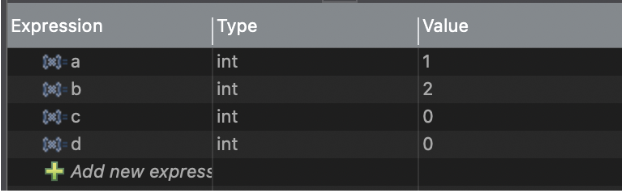
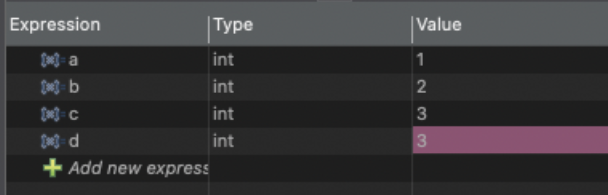
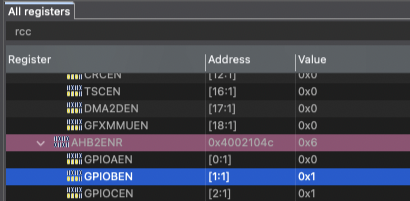

# EE 186 Lab 1
Julia Jiang

## 2. Flashing & Debugging Code
### Flashing Process
During the flashing process, STM32CubeIDE compiles the C source code into ARM machine code, links the object files into an executable, and starts the ST-LINK debugger.

### Build Output
When building the project, files are generated in the Debug folder, including the .elf file.

### Memory Written
We write to the flash memory on the MCU.

### Board Communication
STM32CubeIDE communicates with the board through the onboard ST-LINK debugger over USB. The ST-LINK GDB server manages the debugging connection, and the compiled program is transferred to the MCU using the SWD (Serial Wire Debug) protocol.

## 3. Blinking LEDs
### LEDs Used
LD1, LD2, and LD3

### Pin Mapping
- LD1 -> PC7
- LD2 -> PB7
- LD3 -> PB14

### GPIO Configuration
Yes, these pins are configured as GPIOs. GPIO means general-purpose input/output, which means the MCU can both read and write these pins as if they were a memory location.

They should be configured as outputs since we are turning on LEDs, which means sending data out from the MCU.

### Program Overview
The C program enables the RCC AHB2 clock for GPIO ports B and C, then configures PC7, PB7, and PB14 as general-purpose push-pull outputs. In an infinite loop, it turns the LEDs on in green, blue, then red order, with a software delay between each step so the sequence is visible.

## 4. Blinking LED in Assembly
### Program Overview
The assembly program turns on the blue LED (LD2 / PB7). It enables the GPIO B clock, sets PB7 to general-purpose output mode with a push-pull output type, then writes to the GPIO B bit-set/reset register to turn the LED on. After that, the program stays in an infinite loop.
